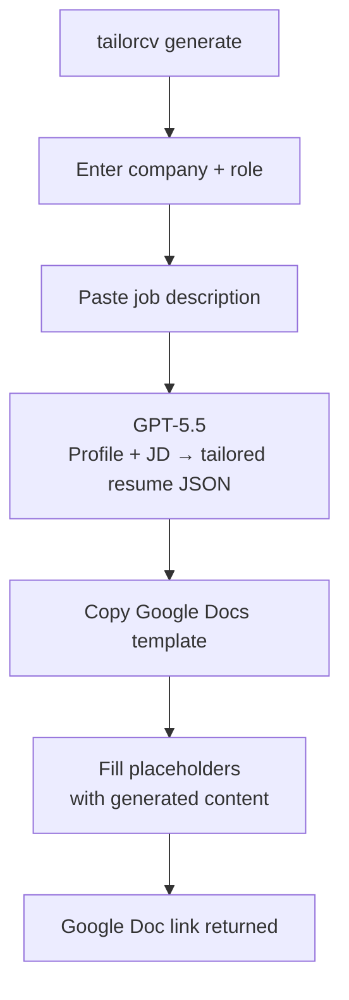
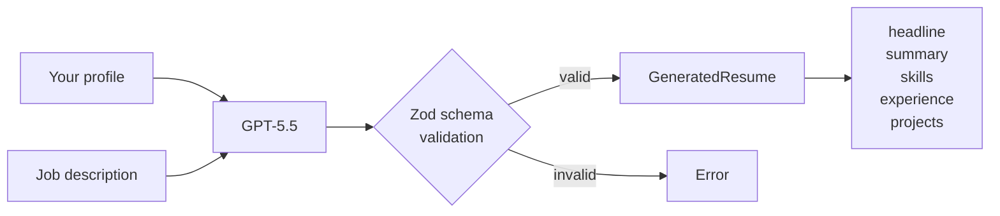

# TailorCV

A CLI that generates tailored, ATS-optimised resumes as formatted Google Docs using your own locally stored profile data and OpenAI API key.

Your data and API keys never leave your machine and your resume lands in your own Google Drive.

## Install

```bash
npm install -g tailorcv
```

## What it does

You store your full career history once. Every time you apply for a job, you paste the job description and the CLI:

1. Sends your profile and JD to GPT-5.5
2. Gets back a tailored resume with headline, summary, skills ordered by relevance, experience and project bullets rewritten to match the role
3. Copies your pre-formatted Google Docs template
4. Fills in the generated content while preserving all your formatting
5. Returns a direct link to the finished doc in your Drive

---

## How it works



### AI generation



The prompt does more than keyword match - it scores the candidate's fit against the JD, identifies must-have vs nice-to-have requirements, handles gaps honestly without highlighting them, and optimises for recruiter shortlisting not just ATS parsing. Anti-hallucination rules prevent invented experience, inflated titles, or missing skills being claimed.

## Requirements

- Node.js 18+
- An OpenAI API key - [platform.openai.com/api-keys](https://platform.openai.com/api-keys)
- A Google account

## Setup

Run once before your first generation:

```bash
tailorcv setup
```

This will:
- Save your OpenAI API key (masked input, tested immediately)
- Walk you through Google OAuth
- Create a `ResumeTailor/` folder in your Drive
- Create a `Resume Template` doc inside it - open it and format it to your liking

All config and keys are stored in `~/.config/resume-tailor/` - never inside the project.

### Google OAuth credentials

You need to create a free Google OAuth app (~5 minutes):

1. Go to [console.cloud.google.com](https://console.cloud.google.com) and create a new project
2. **APIs & Services - Library** - enable **Google Drive API** and **Google Docs API**
3. **APIs & Services - OAuth consent screen** - External, fill in app name and your email
4. **Test users** - add your own Google account email
5. **Credentials - Create Credentials - OAuth client ID** - choose **Desktop app**
6. Copy the Client ID and Client Secret - `tailorcv setup` will ask for them

## Formatting your template

After setup, the CLI prints a link to your template doc. Open it and format it however you want - fonts, spacing, bold headers, tab stops, bullet styles. The CLI preserves all of this on every fill.

**Keep these placeholders exactly as written:**

### Contact and headline
| Placeholder | Fills with |
|---|---|
| `{{name}}` | Full name |
| `{{title}}` | AI-generated headline tailored to the role |
| `{{location}}` | Location |
| `{{email}}` | Email |
| `{{phone}}` | Phone |
| `{{linkedin}}` | LinkedIn URL |
| `{{github}}` | GitHub URL |

### Profile
| Placeholder | Fills with |
|---|---|
| `{{profile_points}}` | 3-4 ATS-optimised summary bullets, one per paragraph |

### Skills
The skills section uses start/end markers so the CLI can bold just the category name on each line:

```
{{skils-start separator=" · "}}
{{skills-section-title}}: {{skills}}
{{skills-end}}
```

Format the `{{skills-section-title}}: {{skills}}` line with whatever style you want - the CLI reads that style and applies it to every generated skill line.

### Experience
Company name, title, location, and dates are static - type them directly in the template. Only the bullets are dynamic:

```
Company Name          Location
Job Title             Dates

{{exp-1-bullet}}
```

| Placeholder | Fills with |
|---|---|
| `{{exp-1-bullet}}` | Tailored bullets for experience entry 1 |
| `{{exp-2-bullet}}` | Tailored bullets for experience entry 2 |
| `{{exp-3-bullet}}` | ...and so on |

### Projects

```
Project Name          {{proj-1-url}}
{{proj-1-skills}}
{{proj-1-bullet}}
```

| Placeholder | Fills with |
|---|---|
| `{{proj-N-skills}}` | Tech stack joined with ` · ` |
| `{{proj-N-url}}` | Project URL from your profile |
| `{{proj-N-bullet}}` | Tailored project bullets |

## Usage

### Fill your profile

```bash
tailorcv profile
```

Arrow-key menus for every section - contact info, skills, work experience, projects, education, certifications. Full add / edit / delete. Saved to `~/.config/resume-tailor/profile.json`.

### Generate a resume

```bash
tailorcv generate
```

1. Enter company name and role title
2. Paste the job description - press Enter twice when done
3. Wait ~15 seconds
4. Get a Google Doc link

The doc is saved to `ResumeTailor/` in your Drive, named `Company - Role - Resume`.

### Reset your template

```bash
tailorcv template
```

Replaces the template doc content with the latest placeholder format if you need to start fresh.

## Commands

| Command | Description |
|---|---|
| `tailorcv setup` | Configure OpenAI key and Google Drive |
| `tailorcv profile` | View and edit your master profile |
| `tailorcv generate` | Generate a tailored resume |
| `tailorcv template` | Reset your Google Docs template |

### Dev

```bash
npm run dev -- generate    # run without building
npm run build              # compile TypeScript to dist/
npm link                   # install tailorcv globally from local build
```

## Data and privacy

| What | Where |
|---|---|
| Profile data | `~/.config/resume-tailor/profile.json` |
| Config + Google token | `~/.config/resume-tailor/config.json` |
| API keys | `~/.config/resume-tailor/.env` |
| Generated resumes | Your Google Drive - `ResumeTailor/` |

Nothing is sent to any server other than OpenAI (your profile + job description) and Google (to create the doc). No analytics, no accounts, no backend.

