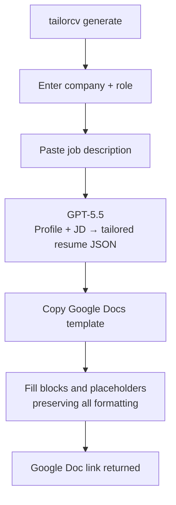
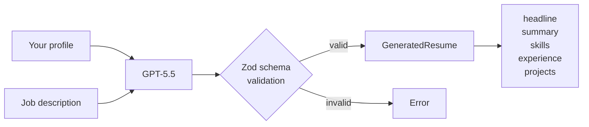

# TailorCV

A CLI that generates tailored, ATS-optimised resumes as formatted Google Docs using your own locally stored profile data and OpenAI API key.

Your data and API keys never leave your machine and your resume lands in your own Google Drive.

## Install

```bash
npm install -g tailorcv
```

## What it does

You store your full career history once. Every time you apply for a job, you paste the job description and the CLI:

1. Sends your profile and JD to GPT-5.5
2. Gets back a tailored resume with headline, summary, skills ordered by relevance, experience and projects rewritten and reordered to match the role
3. Copies your pre-formatted Google Docs template
4. Fills in the generated content while preserving all your formatting including tab stops, fonts, bullet styles, and spacing
5. Returns a direct link to the finished doc in your Drive

---

## How it works



### AI generation



The prompt scores fit against the JD, identifies must-have vs nice-to-have requirements, reorders experience and projects by relevance, handles gaps honestly without highlighting them, and optimises for recruiter shortlisting not just ATS parsing. Anti-hallucination rules prevent invented experience, inflated titles, or missing skills being claimed.

## Requirements

- Node.js 18+
- An OpenAI API key - [platform.openai.com/api-keys](https://platform.openai.com/api-keys)
- A Google account

## Setup

Run once before your first generation:

```bash
tailorcv setup
```

This will:
- Save your OpenAI API key (masked input, tested immediately)
- Walk you through Google OAuth
- Create a `ResumeTailor/` folder in your Drive
- Create a `Resume Template` doc inside it - open it and format it to your liking

All config and keys are stored in `~/.config/resume-tailor/` - never inside the project.

### Google OAuth credentials

You need to create a free Google OAuth app (~5 minutes):

1. Go to [console.cloud.google.com](https://console.cloud.google.com) and create a new project
2. **APIs & Services - Library** - enable **Google Drive API** and **Google Docs API**
3. **APIs & Services - OAuth consent screen** - External, fill in app name and your email
4. **Test users** - add your own Google account email
5. **Credentials - Create Credentials - OAuth client ID** - choose **Desktop app**
6. Copy the Client ID and Client Secret - `tailorcv setup` will ask for them

## Formatting your template

After setup, the CLI prints a link to your template doc. Open it and format it however you want - fonts, spacing, bold headers, bullet styles. The CLI reads the style of each reference line and applies it to every generated entry, preserving your formatting on every fill.

### Template structure

```
{{name}}
{{title}}
{{location}} · {{email}} · {{phone}} · {{linkedin}} · {{github}}

PROFILE

{{profile_points}}

TECHNICAL SKILLS

{{skils-start}}
{{skills-section-title}}: {{skills}}
{{skills-end}}

EXPERIENCE

{{experience-start}}
{{exp-header}}
{{exp-subheader}}
{{exp-bullet}}
{{experience-end}}

PROJECTS

{{projects-start}}
{{proj-header}}
{{proj-tech}}
{{proj-bullet}}
{{projects-end}}

EDUCATION

{{education-start}}
{{edu-header}}
{{edu-subheader}}
{{edu-gpa}}
{{education-end}}

CERTIFICATIONS

{{certifications-start}}
{{cert-line}}
{{certifications-end}}

References available upon request
```

### Contact and headline

| Placeholder | Fills with |
|---|---|
| `{{name}}` | Full name from profile |
| `{{title}}` | AI-generated headline tailored to the role |
| `{{location}}` | Location |
| `{{email}}` | Email |
| `{{phone}}` | Phone |
| `{{linkedin}}` | LinkedIn URL |
| `{{github}}` | GitHub URL |
| `{{profile_points}}` | 3-4 ATS-optimised summary bullets |

### Blocks

Each section between `{{...-start}}` and `{{...-end}}` markers is a block. The lines inside are **style reference lines** - they are never shown in the output. Format them once to define how each type of line should look, and the CLI applies that style to every generated entry.

| Reference line | Format it as | Generates |
|---|---|---|
| `{{exp-header}}` | Bold + right tab stop | `Company [TAB] Location` for every role |
| `{{exp-subheader}}` | Regular/italic + right tab stop | `Title [TAB] Dates` for every role |
| `{{exp-bullet}}` | Bullet list style | Tailored bullets for every role |
| `{{proj-header}}` | Bold + right tab stop | `Project Name [TAB] URL` for every project |
| `{{proj-tech}}` | Italic or small | Tech stack joined with ` · ` |
| `{{proj-bullet}}` | Bullet list style | Tailored project bullets |
| `{{edu-header}}` | Bold + right tab stop | `Institution [TAB] Location` |
| `{{edu-subheader}}` | Regular + right tab stop | `Degree [TAB] Graduation year` |
| `{{skills-section-title}}: {{skills}}` | Your preferred skills style | Skills grouped by category |
| `{{cert-line}}` | Your preferred cert style | `Name · Issuer · Date` per cert |

### Right tab stops

Lines with a `[TAB]` in the table above use a tab character to push the right-hand value (location, dates, URL) to the right margin. To set this up:

1. Click on the reference line (e.g. `{{exp-header}}`)
2. Drag the tab stop marker on the ruler to the right margin, or use **Format → Align and indent** to add a right tab stop
3. Done - the CLI inserts real content before that reference line so every generated paragraph inherits its tab stop automatically

### AI reordering

Experience entries and projects are ordered by relevance to the job description, not the order in your profile. The most relevant role appears first. Location, dates, and project URLs always come from your profile - never from the AI.

## Usage

### Fill your profile

```bash
tailorcv profile
```

Arrow-key menus for every section - contact info, skills, work experience, projects, education, certifications. Full add / edit / delete. Saved to `~/.config/resume-tailor/profile.json`.

### Generate a resume

```bash
tailorcv generate
```

1. Enter company name and role title
2. Paste the job description - press Enter twice when done
3. Wait ~15 seconds
4. Get a Google Doc link

The doc is saved to `ResumeTailor/` in your Drive, named `Company - Role - Resume`.

### Reset your template

```bash
tailorcv template
```

Replaces the template doc content with the latest placeholder format if you need to start fresh.

### Test your template

```bash
tailorcv test
```

Fills the template with mock data and opens the doc so you can check layout, formatting, tab stops, and bullet styles without spending AI tokens. The first run creates a dedicated test doc in your Drive; every subsequent run resets and refills the same doc.

## Commands

| Command | Description |
|---|---|
| `tailorcv setup` | Configure OpenAI key and Google Drive |
| `tailorcv profile` | View and edit your master profile |
| `tailorcv generate` | Generate a tailored resume |
| `tailorcv template` | Reset your Google Docs template |
| `tailorcv test` | Test template layout with mock data |

### Dev

```bash
npm run dev -- generate    # run without building
npm run build              # compile TypeScript to dist/
npm link                   # install tailorcv globally from local build
```

## Data and privacy

| What | Where |
|---|---|
| Profile data | `~/.config/resume-tailor/profile.json` |
| Config + Google token | `~/.config/resume-tailor/config.json` |
| API keys | `~/.config/resume-tailor/.env` |
| Generated resumes | Your Google Drive - `ResumeTailor/` |

Nothing is sent to any server other than OpenAI (your profile + job description) and Google (to create the doc). No analytics, no accounts, no backend.
